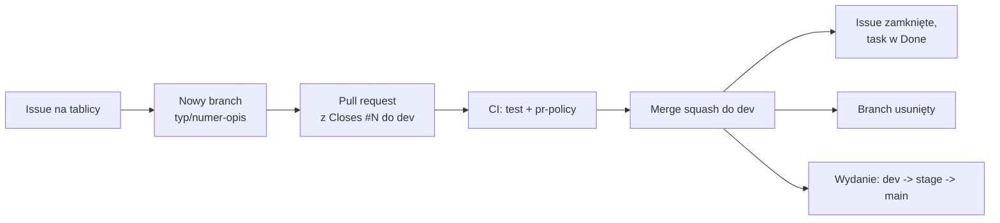

# WorthMyTime - backend

REST API (Sanic, Pydantic, SQLAlchemy async, Alembic).

## Jak pracujemy

Każda zmiana przechodzi ten sam cykl: **issue = nowy branch = pull request = merge = zamknięcie taska = usunięcie brancha**.



1. Zadanie zaczyna się od issue na [tablicy projektu](https://github.com/orgs/worthmytime/projects/1).
2. Dla issue powstaje osobny branch `<typ>/<numer>-<opis>` (np. `feature/12-reset-hasla`), z `dev`, bez commitów prosto na `dev`, `stage` ani `main`.
3. Zmiany trafiają w pull requeście, którego opis zawiera `Closes #<numer>`.
4. PR do `dev` musi przejść CI (`test`, `pr-policy`). Gałęzie `dev`, `stage` i `main` są chronione.
5. Po scaleniu (squash) do `dev` GitHub zamyka issue, przenosi zadanie do Done i usuwa branch.
6. Wydanie: `dev` -> `stage` (testy przed produkcją) -> `main` (produkcja). Do `stage` i `main` scala tylko właściciel (`poewer`).

Szczegóły i konwencje: [CONTRIBUTING.md](CONTRIBUTING.md).

## Uruchomienie lokalnie

```powershell
uv sync --python 3.12
uv run alembic upgrade head      # migracje (SQLite domyślnie, Postgres przez DATABASE_URL)
uv run -m app.main               # http://localhost:8001/api/v1/health
uv run ruff check .
uv run python -m pytest          # SQLite; TEST_DATABASE_URL=... uruchamia testy API na Postgresie
```

## Migracje (Alembic)

> Na Windowsie `uv run alembic ...` bywa blokowane ("Failed to spawn ... Odmowa dostępu"), bo system nie pozwala uruchamiać plików `.exe` z `.venv\Scripts`. Użyj wtedy `uv run python -m alembic ...` (albo `.\.venv\Scripts\python.exe -m alembic ...`). To samo dotyczy `pytest` i `ruff`.

Schemat zarządzany jest wyłącznie migracjami; aplikacja przy starcie tylko sprawdza, czy tabele istnieją.

```powershell
uv run alembic revision --autogenerate -m "opis zmiany"   # po zmianie modeli w app/models.py
uv run alembic upgrade head
uv run alembic downgrade -1
```

Baza utworzona wcześniej przez `create_all` (bez tabeli `alembic_version`): najpierw oznacz ją rewizją odpowiadającą jej schematowi, a potem zastosuj nowsze migracje. Baza sprzed `0002` (bez tabeli `budgets`):

```powershell
uv run alembic stamp 0001
uv run alembic upgrade head
```

Kontener wykonuje `alembic upgrade head` przy każdym starcie.

## Konfiguracja (`.env`, patrz `.env.example`)

| Zmienna | Opis |
|---|---|
| `DATABASE_URL` | `postgresql+asyncpg://...` lub `sqlite+aiosqlite:///./worthmytime.db` |
| `JWT_SECRET` | min. 32 znaki; przy `DEBUG=false` aplikacja nie wystartuje z domyślnym lub krótkim |
| `CORS_ORIGINS` | lista domen po przecinku (`*` tylko do rozwoju) |
| `DEBUG` | `true` luzuje wymagania produkcyjne |
| `LOG_LEVEL` | `INFO` / `DEBUG` ... |
| `RATE_LIMIT_ENABLED` | limity żądań i blokada logowania (domyślnie `true`) |
| `RATE_LIMIT_API_PER_MINUTE` / `RATE_LIMIT_AUTH_PER_MINUTE` | żądania na minutę z jednego IP: ogółem (300) i logowanie/rejestracja (20) |
| `LOGIN_MAX_FAILURES` / `LOGIN_LOCK_SECONDS` | po tylu nieudanych logowaniach na konto z jednego IP (5) blokada na tyle sekund (900) |
| `TRUST_PROXY` | `true` tylko za zaufanym reverse proxy: adres klienta z `X-Forwarded-For` |
| `PORT` | domyślnie 8001 (w kontenerze 8000) |

Pełny stack (db + api + web): `docker compose up --build` w katalogu nadrzędnym (wymaga `JWT_SECRET`).

## Kopie zapasowe i monitoring

Skrypty kopii zapasowej, test odtworzenia i monitoring `/health`: [ops/README.md](ops/README.md).

## Kwoty i zaokrąglenia

Zaokrąglamy w jednym miejscu (`app/money.py`): **ROUND_HALF_UP** na zapisie dziesiętnym (2,675 daje 2,68, a 2,5 daje 3; wbudowane `round()` zaokrągla do parzystej i myli się na liczbach binarnych). Kwoty w bazie to `NUMERIC(14,2)`, stawka godzinowa `NUMERIC(14,4)`; w API nadal są zwykłymi liczbami JSON. Kwoty z żądań są zaokrąglane do groszy przed walidacją.
